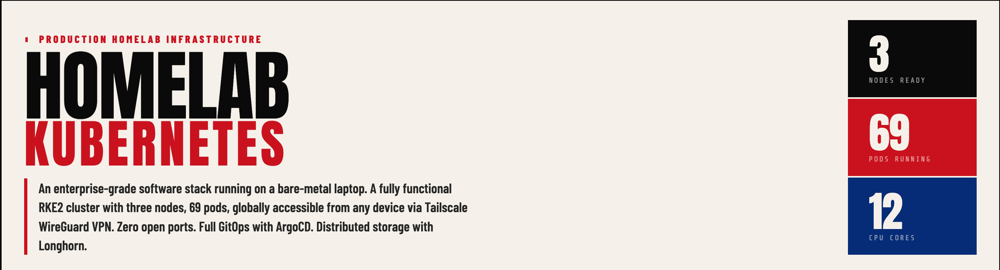
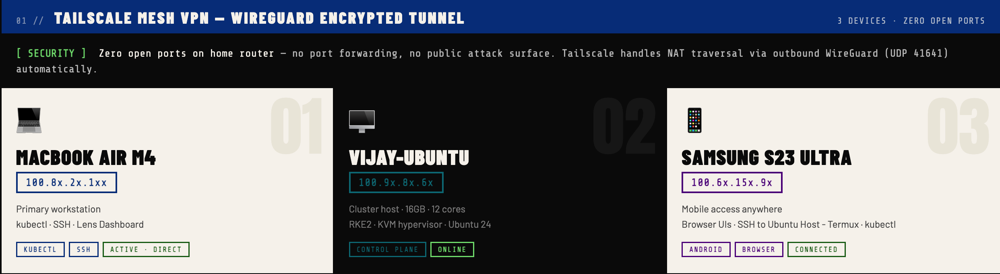
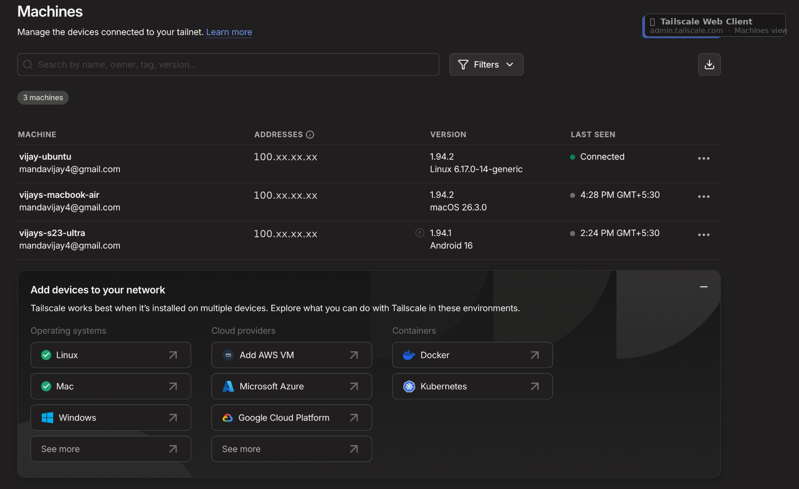
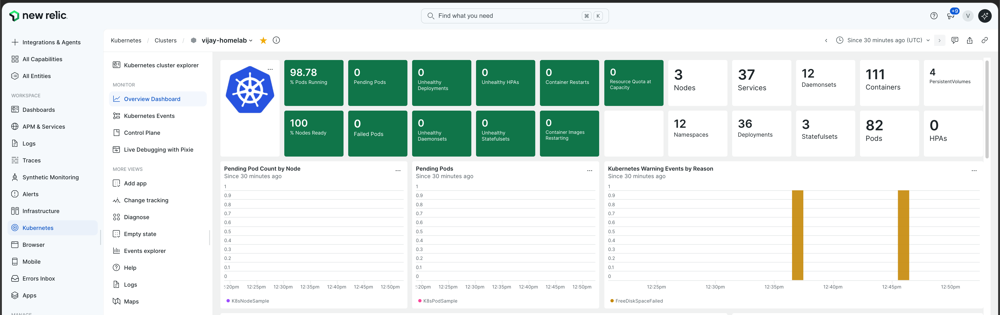
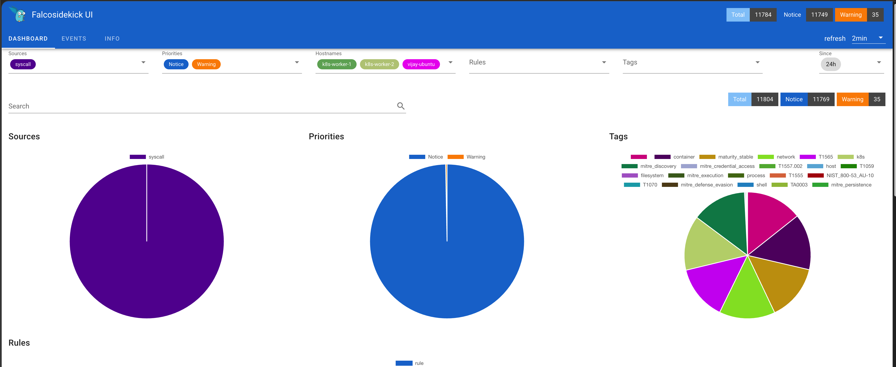
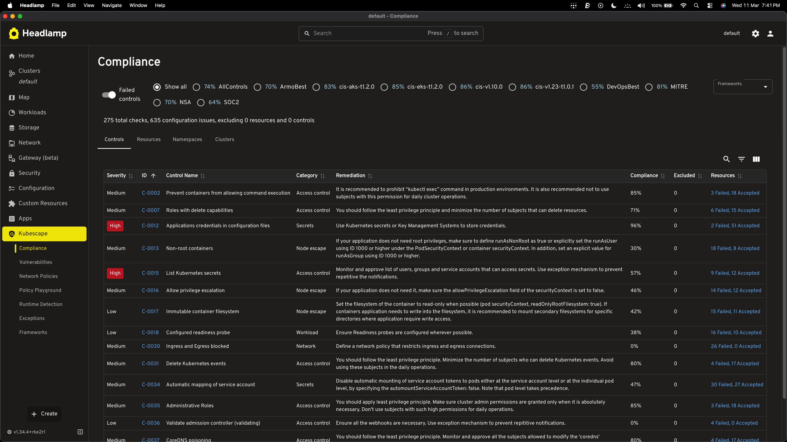
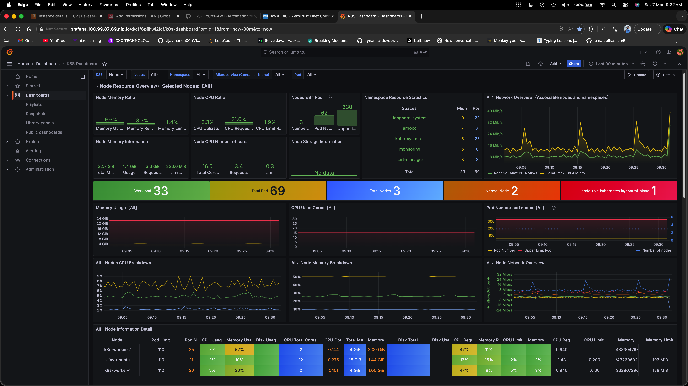
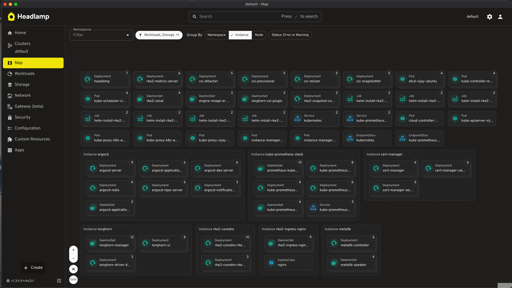
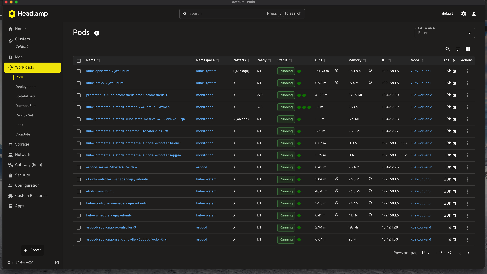

# 🏠 Homelab — Production Kubernetes on a Laptop

## Update one
https://github.com/vijaymanda06/Home-Lab.git

I built a fully functional 3-node Kubernetes cluster that runs 24/7 
on my personal laptop — accessible from anywhere in the world, 
including from my phone, with zero cloud costs and zero open ports.

This isn't a tutorial. It's a working setup I use to learn and 
experiment with the same tools used in real production environments.

## Why I Built This

I kept running into a problem at work — I wanted to test real 
infrastructure setups, but spinning up EKS or GKE every time 
costs money and takes time. I also wanted a place to break things 
without consequences.

So I turned my ASUS laptop into a Kubernetes cluster. The goal 
was simple: run real production-grade tooling — ArgoCD, Prometheus, 
Longhorn, Ingress — on hardware I already owned, and make it 
accessible from anywhere so I could actually use it day to day.

What surprised me was how far you can push a consumer laptop 
when you set it up properly.

## What I Built

## Hardware

Nothing fancy — just a laptop I already had sitting around.

| Component       | Details                                          |
|-----------------|--------------------------------------------------|
| Machine         | ASUS VivoBook X513UA                             |
| CPU             | AMD Ryzen 5 5500U — 6 cores, 12 threads, 4 GHz  |
| RAM             | 15.5 GB                                          |
| Storage         | 512 GB SSD                                       |
| Virtualization  | AMD-V — hardware-assisted KVM                    |
| OS              | Ubuntu 24.04 LTS — Kernel 6.17.0                 |
| Worker VMs      | 2× KVM VMs — 2 vCPU, 4 GB RAM, 20 GB each       |
| Workstation     | MacBook Air M4                                   |
| Mobile          | Samsung S23 Ultra (Android 16)                   |

The two worker nodes are KVM virtual machines running on the same 
laptop. Yes, it's a bit unusual. But it works, and it taught me 
more about virtualization than any course ever did.

## Tailscale — The Piece That Made Everything Possible

Before Tailscale, remote access to a home server meant one of these:
- Open ports on your router (bad idea)
- Set up a VPN server yourself (another thing to maintain)
- Pay for a cloud VM to use as a jump host (defeats the purpose)

Tailscale solved all of that in one command. Every device gets a 
permanent private IP. WireGuard handles the encryption. NAT traversal 
is automatic. I didn't touch my router at all.

The thing I found most satisfying — if I disconnect Tailscale on 
my phone, SSH drops within a second. Nothing is reachable from the 
public internet. The VPN is literally the only way in.

| Device             | Role                          |
|--------------------|-------------------------------|
| vijay-ubuntu       | Cluster host — always on      |
| MacBook Air M4     | Primary workstation           |
| Samsung S23 Ultra  | Mobile management via Termux  |

## The Cluster — Why RKE2

I picked RKE2 over kubeadm after reading about it for about 
ten minutes. kubeadm gives you a cluster. RKE2 gives you a 
CIS-hardened cluster with etcd, containerd, and Canal CNI 
all bundled in — and it's what Rancher uses in production.

For a homelab where I'm trying to learn real patterns, 
that matters more than simplicity.

The control plane runs on the host machine itself. 
The two worker VMs handle all application workloads — 
the control plane is tainted so nothing schedules on it 
by accident.

Currently running 69 pods across the two workers.

## New Relic — Because One Observability Tool Is Never Enough

I already had Prometheus and Grafana running. So why add New Relic? 
Honestly, because every real company uses a commercial observability 
platform, and I wanted to know what that actually looks like from the 
inside — not just read about it.

New Relic gives you something Prometheus doesn't out of the box: a 
unified view of hosts, containers, pods, and logs all in one place 
without building dashboards from scratch. I installed it via the 
official Helm bundle — one chart that drops the infrastructure agent, 
Kubernetes integration, and Fluent Bit log forwarder all at once.

The part that genuinely surprised me — I opened the New Relic mobile 
app on my phone and my entire cluster was right there. Host metrics, 
pod health, 116 containers, all three nodes. Same data I see on my laptop, 
on my phone, over Tailscale. That's the kind of thing that makes a 
homelab feel real.

- **Installed via:** `newrelic-bundle` Helm chart in `newrelic` namespace
- **Agent version:** 1.72.7 running on all 3 nodes
- **What it monitors:** Hosts, containers, Kubernetes pods, deployments, namespaces
- **Logs:** Fluent Bit forwards pod logs directly to New Relic Log API
- **Mobile:** Full cluster visibility from New Relic Android app via Tailscale

## Managing the Cluster from My Phone

This one's a bit ridiculous but it actually works great.

Tailscale on Android + Termux gives me a full terminal on 
my Samsung S23 Ultra. I SSH into the cluster, run kubectl, 
check pod logs, restart deployments — all from my phone.

The browser dashboards (Grafana, Headlamp, ArgoCD) 
work fine on mobile too, especially Headlamp which 
is genuinely well designed for smaller screens.

I've done real troubleshooting sessions from my phone 
while away from my desk. Would not have expected that 
to be practical, but it is.

## Falco — Someone Has to Watch What's Actually Happening

Kubescape tells you what's misconfigured before something goes wrong. 
Falco watches what's actually happening while your cluster is running. 
It sits as a DaemonSet on every node, hooks into the kernel via eBPF, 
and fires an alert the moment something suspicious happens — a shell 
spawned inside a container, a process writing to `/etc`, someone 
trying to read `/proc`.

The way to test it is dead simple. Run `kubectl exec` into any pod, 
and within seconds Falco logs `Terminal shell in container detected`. 
That's not a synthetic test — that's the exact behaviour a real 
attacker would trigger.

- **Installed via:** Helm in `falco` namespace
- **Running as:** DaemonSet on both worker nodes
- **Detects:** Shell access in containers, privilege escalation, suspicious file writes, cryptomining patterns
- **Alerts on:** stdout logs + optional Falcosidekick webhook integrations
- **Why it matters:** Kubescape = security audit. Falco = live CCTV.

## Kubescape — Knowing Your Security Score

I ran Kubescape against two industry frameworks to see where the 
cluster actually stands:

- **MITRE ATT&CK: 74%**
- **NSA-CISA: 69%**

For a self-hosted homelab, that's solid. The failing checks are almost 
all expected — Longhorn needs privileged containers, MetalLB needs 
HostNetwork access, RKE2 system pods use HostPath mounts. These aren't 
real risks in this setup, they're just the cost of running real 
infrastructure without a managed cloud provider doing the heavy lifting 
for you.

Kubescape runs as an operator in-cluster (continuous scanning) and the 
results show up inside the Headlamp plugin — which means I can see my 
security posture right alongside pod health and resource usage in the 
same dashboard.

- **In-cluster operator:** Running in `kubescape` namespace, scans on schedule
- **UI:** Headlamp plugin at `http://headlamp.100.99.87.69.nip.io`
- **CLI scans:** `kubescape scan framework nsa` / `kubescape scan framework mitre`
- **Findings:** HostPath mounts and HostNetwork — expected for RKE2 + Longhorn, not real threats

## The Perimeter

The actual security model is simple: Tailscale is the 
perimeter. Nothing is open to the internet. No ports 
forwarded. Disconnect VPN — access is gone instantly.
Audit logging is enabled at the API server level.

## Monitoring — Prometheus, Grafana, Headlamp

Installed via kube-prometheus-stack. One thing worth noting — 
I tried to deploy it through ArgoCD first. Hit a known bug 
where the Prometheus CRDs exceed ArgoCD's annotation size limit.
The fix was to install it directly with Helm and let ArgoCD 
manage everything else.

Current cluster state:
- 3 nodes, 69 pods, all healthy
- CPU: ~12% utilized across the cluster  
- RAM: ~67% utilized
- Metrics retained for 7 days on Longhorn-backed storage

## Networking — MetalLB + Ingress + nip.io

Getting LoadBalancer services to work outside of a cloud 
provider is the first real challenge in bare-metal Kubernetes.
MetalLB solves this by responding to ARP requests on your network,
making Kubernetes think it has a cloud load balancer available.

I pointed MetalLB's IP pool at my Tailscale IP — which means 
every LoadBalancer service is automatically reachable from any 
device on my Tailscale network.

For DNS, I use nip.io — a free wildcard DNS service where 
anything.IP.nip.io resolves to that IP automatically. No domain 
purchase. No DNS record management. It just works.

So grafana.100.x.x.x.nip.io opens Grafana on any device, 
as long as Tailscale is connected.

## Storage — Longhorn

The first time I deployed Prometheus without persistent storage, 
I restarted a pod and lost two days of metrics. That was the moment 
I actually understood why distributed storage matters.

Longhorn replicates every volume across both worker nodes. 
If a worker goes down, the other has a full copy. When it 
comes back, Longhorn rebuilds the replica automatically.

Currently backing:
- Prometheus: 10 GB PVC
- Grafana: 2 GB PVC (dashboards survive restarts)

